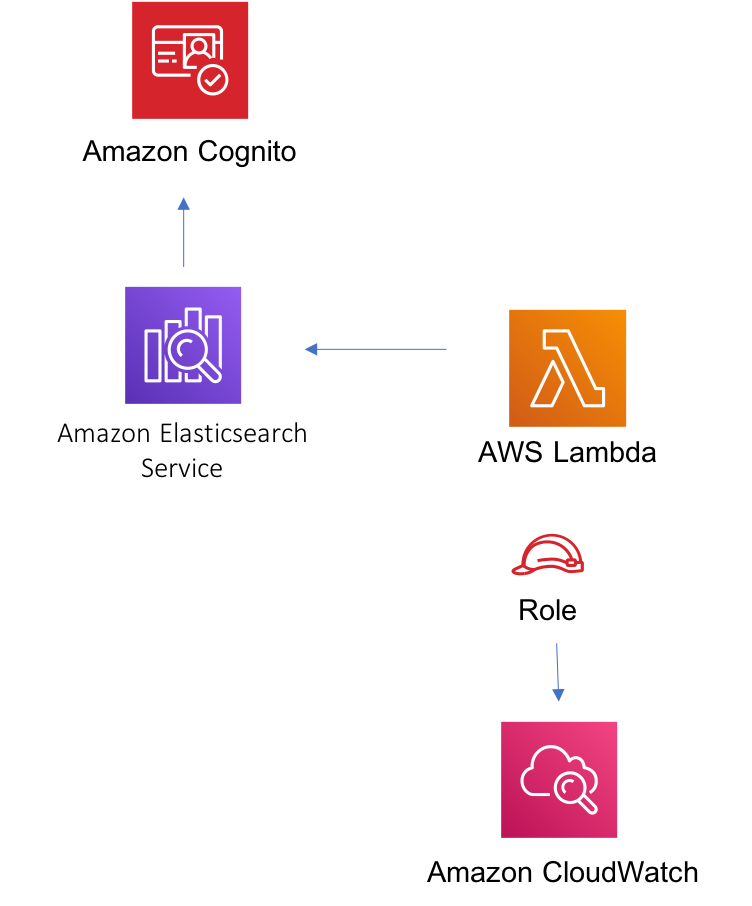

# aws-lambda-elasticsearch-kibana module
<!--BEGIN STABILITY BANNER-->

---


> All classes are under active development and subject to non-backward compatible changes or removal in any
> future version. These are not subject to the [Semantic Versioning](https://semver.org/) model.
> This means that while you may use them, you may need to update your source code when upgrading to a newer version of this package.

---
<!--END STABILITY BANNER-->

| **Reference Documentation**:| <span style="font-weight: normal">https://docs.aws.amazon.com/solutions/latest/constructs/</span>|
|:-------------|:-------------|
<div style="height:8px"></div>

| **Language**     | **Package**        |
|:-------------|-----------------|
| Python|`aws_solutions_constructs.aws_lambda_elasticsearch_kibana`|
| Typescript|`@aws-solutions-constructs/aws-lambda-elasticsearch-kibana`|
| Java|`software.amazon.awsconstructs.services.lambdaelasticsearchkibana`|

This AWS Solutions Construct implements the AWS Lambda function and Amazon Elasticsearch Service with the least privileged permissions.

Here is a minimal deployable pattern definition:

``` javascript
const { LambdaToElasticSearchAndKibana } = require('@aws-solutions-constructs/aws-lambda-elasticsearch-kibana');

const lambdaProps: lambda.FunctionProps = {
    code: lambda.Code.asset(`${__dirname}/lambda`),
    runtime: lambda.Runtime.NODEJS_12_X,
    handler: 'index.handler'
};

new LambdaToElasticSearchAndKibana(stack, 'test-lambda-elasticsearch-kibana', {
    lambdaFunctionProps: lambdaProps,
    domainName: 'test-domain'
});

```

## Initializer

``` text
new LambdaToElasticSearchAndKibana(scope: Construct, id: string, props: LambdaToElasticSearchAndKibanaProps);
```

_Parameters_

* scope [`Construct`](https://docs.aws.amazon.com/cdk/api/latest/docs/@aws-cdk_core.Construct.html)
* id `string`
* props [`LambdaToElasticSearchAndKibanaProps`](#pattern-construct-props)

## Pattern Construct Props

| **Name**     | **Type**        | **Description** |
|:-------------|:----------------|-----------------|
|existingLambdaObj?|[`lambda.Function`](https://docs.aws.amazon.com/cdk/api/latest/docs/@aws-cdk_aws-lambda.Function.html)|Existing instance of Lambda Function object, if this is set then the lambdaFunctionProps is ignored.|
|lambdaFunctionProps?|[`lambda.FunctionProps`](https://docs.aws.amazon.com/cdk/api/latest/docs/@aws-cdk_aws-lambda.FunctionProps.html)|User provided props to override the default props for the Lambda function.|
|esDomainProps?|[`elasticsearch.CfnDomainProps`](https://docs.aws.amazon.com/cdk/api/latest/docs/@aws-cdk_aws-elasticsearch.CfnDomainProps.html)|Optional user provided props to override the default props for the Elasticsearch Service|
|domainName|`string`|Domain name for the Cognito and the Elasticsearch Service|

## Pattern Properties

| **Name**     | **Type**        | **Description** |
|:-------------|:----------------|-----------------|
|lambdaFunction|[`lambda.Function`](https://docs.aws.amazon.com/cdk/api/latest/docs/@aws-cdk_aws-lambda.Function.html)|Returns an instance of lambda.Function created by the construct|
|userPool|[`cognito.UserPool`](https://docs.aws.amazon.com/cdk/api/latest/docs/@aws-cdk_aws-cognito.UserPool.html)|Returns an instance of cognito.UserPool created by the construct|
|userPoolClient|[`cognito.UserPoolClient`](https://docs.aws.amazon.com/cdk/api/latest/docs/@aws-cdk_aws-cognito.UserPoolClient.html)|Returns an instance of cognito.UserPoolClient created by the construct|
|identityPool|[`cognito.CfnIdentityPool`](https://docs.aws.amazon.com/cdk/api/latest/docs/@aws-cdk_aws-cognito.CfnIdentityPool.html)|Returns an instance of cognito.CfnIdentityPool created by the construct|
|elasticsearchDomain|[`elasticsearch.CfnDomain`](https://docs.aws.amazon.com/cdk/api/latest/docs/@aws-cdk_aws-elasticsearch.CfnDomain.html)|Returns an instance of elasticsearch.CfnDomain created by the construct|
|cloudwatchAlarms|[`cloudwatch.Alarm[]`](https://docs.aws.amazon.com/cdk/api/latest/docs/@aws-cdk_aws-cloudwatch.Alarm.html)|Returns a list of cloudwatch.Alarm created by the construct|

## Default settings

Out of the box implementation of the Construct without any override will set the following defaults:

### AWS Lambda Function
* Configure least privilege access IAM role for Lambda function
* Enable reusing connections with Keep-Alive for NodeJs Lambda function

### Amazon Cognito
* Set password policy for User Pools
* Enforce the advanced security mode for User Pools

### Amazon Elasticsearch Service
* Deploy best practices CloudWatch Alarms for the Elasticsearch Domain
* Secure the Kibana dashboard access with Cognito User Pools
* Enable server-side encryption for Elasticsearch Domain using AWS managed KMS Key
* Enable node-to-node encryption for Elasticsearch Domain
* Configure the cluster for the Amazon ES domain

## Architecture


***
&copy; Copyright 2020 Amazon.com, Inc. or its affiliates. All Rights Reserved.