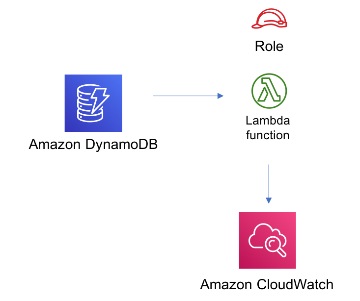

# aws-dynamodb-stream-lambda module
<!--BEGIN STABILITY BANNER-->

---


> **This is a _developer preview_ (public beta) module.**
>
> All classes are under active development and subject to non-backward compatible changes or removal in any
> future version. These are not subject to the [Semantic Versioning](https://semver.org/) model.
> This means that while you may use them, you may need to update your source code when upgrading to a newer version of this package.

---
<!--END STABILITY BANNER-->

| **API Reference**:| <span style="font-weight: normal">http://docs.awssolutionsbuilder.com/aws-solutions-konstruk/latest/api/aws-dynamodb-stream-lambda/</span>|
|:-------------|:-------------|
<div style="height:8px"></div>

| **Language**     | **Package**        |
|:-------------|-----------------|
|{: style="height:16px;width:16px"} Python|`aws_solutions_konstruk.aws_dynamodb_stream_lambda`|
|{: style="height:16px;width:16px"} Typescript|`@aws-solutions-konstruk/aws-dynamodb-stream-lambda`|

This AWS Solutions Konstruk implements a pattern Amazon DynamoDB table with stream to invoke the AWS Lambda function  with the least privileged permissions.

Here is a minimal deployable pattern definition:

``` javascript
const { DynamoDBStreamToLambdaProps,  DynamoDBStreamToLambda} = require('@aws-solutions-konstruk/aws-dynamodb-stream-lambda');

const props: DynamoDBStreamToLambdaProps = {
    deployLambda: true,
    lambdaFunctionProps: {
        code: lambda.Code.asset(`${__dirname}/lambda`),
        runtime: lambda.Runtime.NODEJS_12_X,
        handler: 'index.handler'
    },
};

new DynamoDBStreamToLambda(stack, 'test-dynamodb-stream-lambda', props);

```

## Initializer

``` text
new DynamoDBStreamToLambda(scope: Construct, id: string, props: DynamoDBStreamToLambdaProps);
```

_Parameters_

* scope [`Construct`](https://docs.aws.amazon.com/cdk/api/latest/docs/@aws-cdk_core.Construct.html)
* id `string`
* props [`DynamoDBStreamToLambdaProps`](#pattern-construct-props)

## Pattern Construct Props

| **Name**     | **Type**        | **Description** |
|:-------------|:----------------|-----------------|
|deployLambda|`boolean`|Whether to create a new Lambda function or use an existing Lambda function|
|existingLambdaObj?|[`lambda.Function`](https://docs.aws.amazon.com/cdk/api/latest/docs/@aws-cdk_aws-lambda.Function.html)|Existing instance of Lambda Function object|
|lambdaFunctionProps?|[`lambda.FunctionProps`](https://docs.aws.amazon.com/cdk/api/latest/docs/@aws-cdk_aws-lambda.FunctionProps.html)|Optional user provided props to override the default props for Lambda function|
|dynamoTableProps?|[`dynamodb.TableProps`](https://docs.aws.amazon.com/cdk/api/latest/docs/@aws-cdk_aws-dynamodb.TableProps.html)|Optional user provided props to override the default props for DynamoDB Table|
|dynamoEventSourceProps?|[`aws-lambda-event-sources.DynamoEventSourceProps`](https://docs.aws.amazon.com/cdk/api/latest/docs/@aws-cdk_aws-lambda-event-sources.DynamoEventSourceProps.html)|Optional user provided props to override the default props for DynamoDB Event Source|

## Pattern Properties

| **Name**     | **Type**        | **Description** |
|:-------------|:----------------|-----------------|
|dynamoTable()|[`dynamodb.Table`](https://docs.aws.amazon.com/cdk/api/latest/docs/@aws-cdk_aws-dynamodb.Table.html)|Retruns an instance of dynamodb.Table created by the construct|
|lambdaFunction()|[`lambda.Function`](https://docs.aws.amazon.com/cdk/api/latest/docs/@aws-cdk_aws-lambda.Function.html)|Retruns an instance of lambda.Function created by the construct|

## Architecture


***
&copy; Copyright 2020 Amazon.com, Inc. or its affiliates. All Rights Reserved.