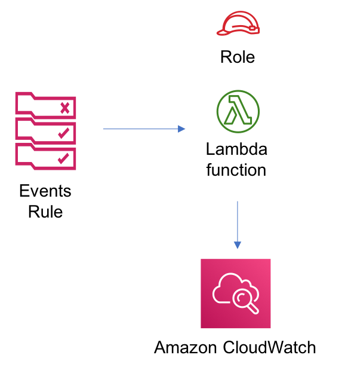

# aws-events-rule-lambda module
<!--BEGIN STABILITY BANNER-->

---


> **This is a _developer preview_ (public beta) module.**
>
> All classes are under active development and subject to non-backward compatible changes or removal in any
> future version. These are not subject to the [Semantic Versioning](https://semver.org/) model.
> This means that while you may use them, you may need to update your source code when upgrading to a newer version of this package.

---
<!--END STABILITY BANNER-->

| **API Reference**:| <span style="font-weight: normal">http://docs.awssolutionsbuilder.com/aws-solutions-konstruk/latest/api/aws-events-rule-lambda/</span>|
|:-------------|:-------------|
<div style="height:8px"></div>

| **Language**     | **Package**        |
|:-------------|-----------------|
|{: style="height:16px;width:16px"} Python|`aws_solutions_konstruk.aws_events_rule_lambda`|
|{: style="height:16px;width:16px"} Typescript|`@aws-solutions-konstruk/aws-events-rule-lambda`|

This AWS Solutions Konstruk implements an AWS Events rule and an AWS Lambda function.

Here is a minimal deployable pattern definition:

``` javascript
const { EventsRuleToLambdaProps, EventsRuleToLambda } = require('@aws-solutions-konstruk/aws-events-rule-lambda');

const props: EventsRuleToLambdaProps = {
    deployLambda: true,
    lambdaFunctionProps: {
        code: lambda.Code.asset(`${__dirname}/lambda`),
        runtime: lambda.Runtime.NODEJS_12_X,
        handler: 'index.handler'
    },
    eventRuleProps: {
      schedule: events.Schedule.rate(Duration.minutes(5))
    }
};

new EventsRuleToLambda(stack, 'test-events-rule-lambda', props);
```

## Initializer

``` text
new EventsRuleToLambda(scope: Construct, id: string, props: EventsRuleToLambdaProps);
```

_Parameters_

* scope [`Construct`](https://docs.aws.amazon.com/cdk/api/latest/docs/@aws-cdk_core.Construct.html)
* id `string`
* props [`EventsRuleToLambdaProps`](#pattern-construct-props)

## Pattern Construct Props

| **Name**     | **Type**        | **Description** |
|:-------------|:----------------|-----------------|
|deployLambda|`boolean`|Whether to create a new lambda function or use an existing lambda function|
|existingLambdaObj?|[`lambda.Function`](https://docs.aws.amazon.com/cdk/api/latest/docs/@aws-cdk_aws-lambda.Function.html)|Existing instance of Lambda Function object|
|lambdaFunctionProps|[`lambda.FunctionProps`](https://docs.aws.amazon.com/cdk/api/latest/docs/@aws-cdk_aws-lambda.FunctionProps.html)|Optional user provided props to override the default props for lambda.Function|
|eventRuleProps|[`events.RuleProps`](https://docs.aws.amazon.com/cdk/api/latest/docs/@aws-cdk_aws-events.RuleProps.html)|User provided eventRuleProps to override the defaults|

## Pattern Properties

| **Name**     | **Type**        | **Description** |
|:-------------|:----------------|-----------------|
|eventsRule()|[`events.Rule`](https://docs.aws.amazon.com/cdk/api/latest/docs/@aws-cdk_aws-events.Rule.html)|Retruns an instance of events.Rule created by the construct|
|lambdaFunction()|[`lambda.Function`](https://docs.aws.amazon.com/cdk/api/latest/docs/@aws-cdk_aws-lambda.Function.html)|Retruns an instance of lambda.Function created by the construct|

## Architecture


***
&copy; Copyright 2020 Amazon.com, Inc. or its affiliates. All Rights Reserved.