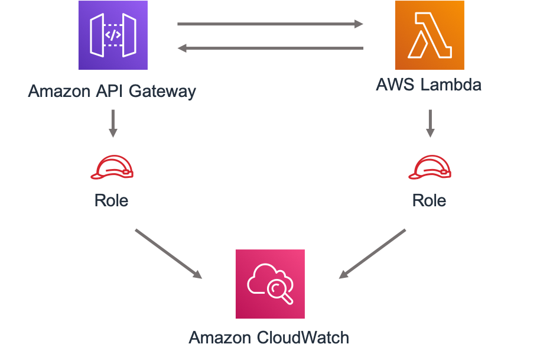

# AWS Serverless Image Handler

This use case construct implements an Amazon CloudFront distribution, an Amazon API Gateway REST API, an AWS Lambda
function, and necessary permissions/logic to provision a functional image handler API for serving image content from 
one or more Amazon S3 buckets within the deployment account.

Here is a minimal deployable pattern definition:

```
const { ServerlessImageHandler } = require('@aws-konstruk/aws-serverless-image-handler');

new ServerlessImageHandler(stack, 'ServerlessImageHandlerPattern', {
    deployLambda: true,
    lambdaFunctionProps: {
        runtime: lambda.Runtime.NODEJS_12_X,
        handler: 'index.handler',
        code: lambda.Code.asset(`${__dirname}/lambda`)
    }
});

```

## Properties

| **Name**     | **Type**        | **Description** |
|:-------------|:----------------|-----------------|
|deployLambda|`boolean`|Whether to create a new Lambda function or use an existing Lambda function. If set to false, you must provide an existing function for the `existingLambdaObj` property.|
|existingLambdaObj?|`lambda.Function`|An optional, existing Lambda function. This property is required if `deployLambda` is set to false.|
|lambdaFunctionProps?|`lambda.FunctionProps`|Optional user-provided props to override the default props for the Lambda function. This property is only required if `deployLambda` is set to true.|
|apiGatewayProps?|`api.LambdaRestApiProps`|Optional user-provided props to override the default props for the API.|

## Architecture


***
&copy; Copyright 2019 Amazon.com, Inc. or its affiliates. All Rights Reserved.